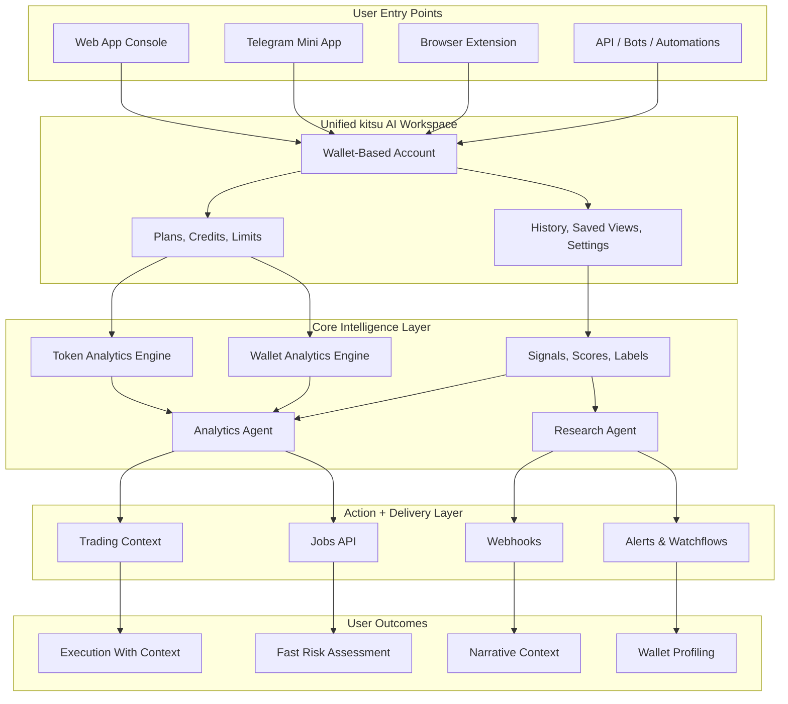
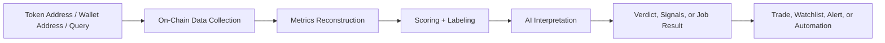
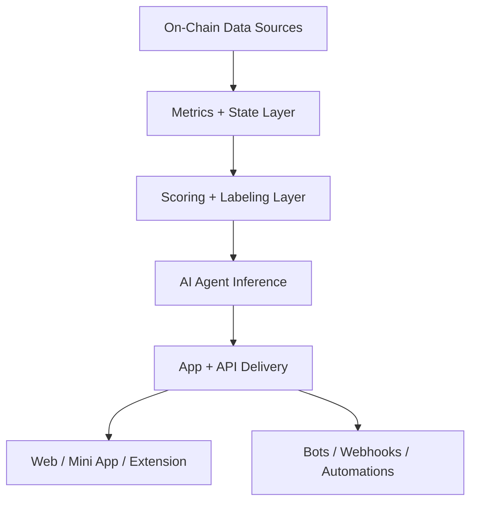

# Kitsu AI

**AI-native on-chain analytics, wallet intelligence, research agents, and execution context for Solana**

*Token analytics • Wallet profiling • Signals • Research agents • In-app trading • Credits-based API*

---

## Quick Links

---

## What This System Does

kitsu AI is an AI-native on-chain analytics system that turns raw token and wallet activity into scores, labels, signals, and short verdicts that help traders, researchers, and automation builders make faster decisions with less noise

> [!IMPORTANT]
> kitsu AI is designed as one unified product across the web app, Telegram Mini App, browser extension, and API integrations, with shared credits, history, limits, and account context

Instead of forcing users to interpret fragmented dashboards, kitsu AI compresses structure, behavior, and market context into a workflow that answers a few core questions quickly:

- Is this token structurally safe enough for my size
- What type of wallet is behind this address
- What changed, and do I need to react now
- Is this setup suitable for small degen size, swing size, or a hard pass

---

## Product View

The product is not split into disconnected tools. It is one workspace with several access surfaces and one shared intelligence layer underneath

| Layer | What it handles | Why it matters |
|---|---|---|
| Access | App, Mini App, extension, API | One account, multiple entry points |
| Intelligence | Token analysis, wallet analysis, agents | Clear decisions instead of raw noise |
| Delivery | Alerts, jobs, webhooks, trading context | The same outputs can power manual and automated workflows |

---

## Input → Output Flow

kitsu AI follows a compact pipeline: ingest public blockchain data, rebuild structure and behavior, score it, interpret it with AI, and return outputs that can be consumed by people or systems

> [!TIP]
> The same credit logic applies across UI and API, which keeps the mental model simple for both manual users and automation builders

---

## Core Engines

### Token Analytics Engine

The Token Analytics Engine evaluates structure before hype. It focuses on liquidity quality, volume patterns, holder concentration, and control risk so users can understand how fragile or tradable a token really is

**Primary outputs**
- Structural risk score
- Liquidity quality score
- Holder concentration score
- Degen factor
- Short structural verdict

**What it is good at**
- Classifying meme and narrative tokens by risk quality
- Distinguishing organic flow from fragile reflexive activity
- Flagging team-heavy supply or dangerous permissions early

> [!WARNING]
> Signals and AI verdicts are decision support tools, not guarantees of safety or profitability

### Wallet Analytics Engine

The Wallet Analytics Engine reconstructs a trading profile instead of showing only a raw transaction feed. It looks at PnL behavior, drawdowns, consistency, holding style, sizing patterns, and exposure quality

**Primary outputs**
- Performance score
- Risk discipline score
- Consistency score
- Degeneracy score
- Short wallet-style summary

**What it is good at**
- Grading wallets before copying or tracking them
- Separating repeatable traders from lucky outliers
- Turning watchlists into structured profiles instead of spreadsheets

### Signals, Scores, and Labels Layer

This layer compresses complexity into things users can scan quickly

| Output Type | Role | Example |
|---|---|---|
| Scores | Numeric structural gauges | Liquidity quality, consistency |
| Labels | Human-readable tags | Whale-driven, thin liquidity |
| Signals | Attention triggers | Whale accumulation, liquidity outflow |

### Analytics Agent

The Analytics Agent sits on top of the structured data and explains what the numbers actually mean in plain language

It produces a repeatable format:
- a small group of scores
- 2–3 key bullets
- a short verdict for sizing and attention

### Research Agent

The Research Agent adds narrative and market context around tokens, themes, and sectors. It helps answer why something is moving, which narratives are involved, and what the main bullish and bearish arguments currently look like

> [!NOTE]
> Research is most useful after structural analytics, not instead of it

---

## Control Surface

Users can control the system without being overwhelmed by knobs

| Area | What users can control |
|---|---|
| Account | Wallet-based sign-in, profile, usage history |
| Planing & spend | Free tier, paid plans, top-ups, credit visibility |
| Analysis mode | Quick checks, full analysis, deeper research |
| API usage | Separate keys for dev, staging, and production |
| Integrations | Webhooks, bots, n8n, Zapier, custom backends |
| Trading context | Slippage awareness, route visibility, size discipline |

The control model is intentionally simple:
- one account
- one credits system
- one cross-surface history
- one mental model for both UI and API

> [!CAUTION]
> API keys should be stored server-side only, rotated when needed, and never exposed in frontend code or public repositories

---

## Advanced Usage

kitsu AI is built for both fast manual workflows and more advanced system-driven usage

### For active traders
- run token analysis before opening a position
- confirm structural quality before reacting to hype
- re-check a bag when liquidity, whales, or control risk change

### For wallet hunters
- analyze a wallet before following it
- compare style, risk discipline, and repeatability
- clean watchlists by removing structurally weak addresses

### For builders and power users
- call token and wallet agents through the API
- run async jobs for heavier workflows
- consume webhooks instead of polling aggressively
- route outputs into dashboards, bots, and alerts

### For ecosystem participants
- use $KITSU for credit top-ups and better effective usage economics
- track burn and treasury flows through public on-chain visibility
- follow product usage through verifiable dashboards

---

## Infra / Stack

The system is designed around a clean separation between analytics, agent inference, delivery, and user-facing surfaces

### Architecture view

| Module | Function |
|---|---|
| On-chain ingestion | Reads token, wallet, liquidity, and activity data |
| Metrics layer | Reconstructs structured state from raw events |
| Scoring layer | Produces compact token and wallet health signals |
| Agent layer | Converts analytics into short actionable summaries |
| Delivery layer | Serves app, API, jobs, alerts, and webhook events |

### Core product mechanics
- wallet-based non-custodial identity
- plans plus unified credits
- sync and async agent runs
- event-driven integrations via webhooks
- analytics-first trading context on supported networks

> [!IMPORTANT]
> Solana is the primary launch network and the first fully supported environment for token analytics, wallet analytics, signals, and in-app trading

---

## Benchmarks / Reality

kitsu AI is built around practical outputs, not abstract promises

### What actually works as a product model
- compact scores and labels for fast scanning
- short AI summaries that reduce reading time
- a shared credits model across app and API
- one account across multiple surfaces
- async jobs and webhooks for automation-friendly usage

### What users should realistically expect
- decision support, not certainty
- better context before entering or sizing positions
- faster wallet grading and token filtering
- clearer routing and slippage visibility before execution

| Reality Check | What it means |
|---|---|
| Non-custodial | Users sign all actions in their own wallet |
| Analytics-first | The system is designed to show structure before execution |
| Multi-surface | App, Mini App, extension, and API share one product model |
| Token utility | $KITSU improves usage economics but is not mandatory for basic access |

> [!WARNING]
> kitsu AI does not remove market risk, smart contract risk, execution risk, or user error. It helps surface them earlier and more clearly

---

## Access

### Getting started
1. Connect your wallet
2. Sign a message to create your profile
3. Use the free starter credits to run real checks
4. Upgrade or top up if you need more volume
5. Add API keys or integrations when you move into automation

### Plans and credits
Every heavy operation consumes known credits:
- **X** for quick checks
- **Y** for full analysis
- **Z** for heavier research or jobs

The same pricing logic applies across the app and API, which keeps usage predictable

### $KITSU utility model
$KITSU is the native utility token of kitsu AI and plugs directly into credits and usage economics

| Spend Flow | Allocation |
|---|---|
| $KITSU spent in-platform | 80% burned |
| Remaining portion | 20% sent to treasury |

This design links real platform activity to token supply and ecosystem funding over time

---

## Security, Verifiability, and Trust

> [!IMPORTANT]
> kitsu AI is fully non-custodial. The platform never asks for private keys or seed phrases

### Security posture
- message-signing based access
- no custody of user funds
- visible routing and slippage before trade confirmation
- revocable API keys with account-level limits
- signed webhooks for backend verification
- HTTPS-only API traffic
- monitoring and abuse controls around keys and usage spikes

### Verifiability
- burn and treasury flows are designed to be visible on-chain
- public dashboards can surface supply, burn totals, treasury balances, and usage-linked token flows
- tokenomics are intended to be understandable in plain language, not hidden behind opaque mechanics

> [!CAUTION]
> Users remain responsible for wallet security, transaction review, safe key handling, and position sizing

---

## Disclaimer

kitsu AI provides analytics, summaries, scores, labels, and infrastructure for research and execution context. It does not provide financial advice, guarantees of performance, or protection from market losses

Use the system as an intelligence layer, not as a substitute for judgment
